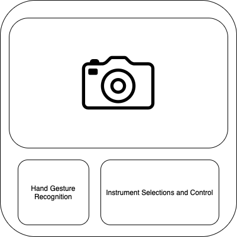

# Music By Vision

- [X] Start a GUI App (`PyQt6` `Python3`)
- [X] Show Webcam Feed on the GUI
- [X] Show Object Detection Output in Realtime on the GUI App
- [X] Hand Landmark Tracking Implementation
- [ ] Assign Music to Each Finger
- [ ] Find a way to play music in the GUI
- [ ] Make the Music tone change based on gesture shown via WebCam
- [ ] Music by Vision Completed

## To run
- Create and Activate Python3 virtual environment `python3 -m venv env_name` and `source env_name/bin/activate`
- Install the module using `pip install -r requirements.txt`
- To run the GUI App `python app.py`

### Sample Output

- Index Figure when raised and straight is detected and music is played in a seperate thread.

### Concept GUI App

